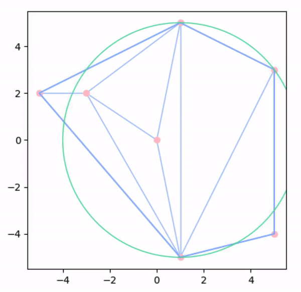
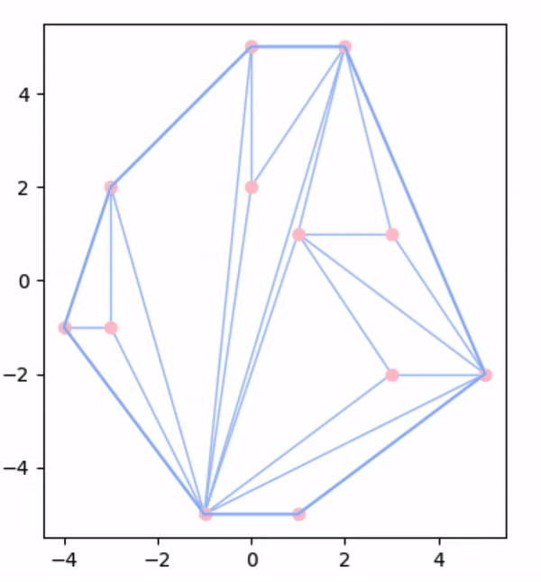

# Edge-flipping Animation
Yanning Tan and Ziyue Yang

## Introduction

This project is an implementation of Edge-flipping algorithm of Delaunay triangulation. Delaunay triangulations maximize the minimum angle of all the angles of the triangles in the triangulation. This algorithm  takes in a certain number of randomly generated points in general position and returns a Delaunay triangulation.


[Graham scan](https://replit.com/@ZiyueYang1/Graham-animation#README.md) is implemented to compute the convex hull. [Triangle-splitting](https://replit.com/@ZiyueYang1/Triangle-Splitting-Animation#README.md) is implemented to triangulate the hull. 

An animation is also generated to visualize the splitting process via `matplotlib`. 

## Background

### Empty circle property 

Retrieved from **Theorem 3.53**.

Let S be a point set in general position. A triangulation T is a Delaunay triangulation if and only if no points from S is in the interior of any circumcircle of a triangle of T.

### Edge Flipping Algorithm

Retrieved from **p. 83**. 

Let S be a point set in general position. Start with any triangulation T. If two triangles do not meet the Delaunay condition, switching the common edge BD for the common edge AC produces two triangles that do meet the Delaunay condition. Continue flipping illegal edges, moving through the flip graph of S in any order, until no more illegal edges remain. 

## Code walk-through

```
Generate points in general position
Compute the convex hull via Graham Scan
Triangulate the hull via triangle splitting algorithm 

new_diagonal_list = []

while new_diagonal_list != old_diagonal_list: 

  # this step makes sure that old_diagonal_list is one iteration behind new_diagonal_list
  old_diagonal_list = new_diagonal_list 
    
  for diagonal in old_diagonal_list :
    
    # find correspondence triangles and their vertices
    findTriangles() 
  
    sortByAngle(pa, pb, pc, check_point)

    if incirclefast(pa, pb, pc, check_point) <= 0: # valid Delaunay
      new_diagonal_list.append(diagonal)
      continue
      
    else: # invalid Delaunay
      new_diagonal_list.append(pb, check_point)
```

## Examples
- Example #1 -- 10 points


-  Example #2 -- 20 points
